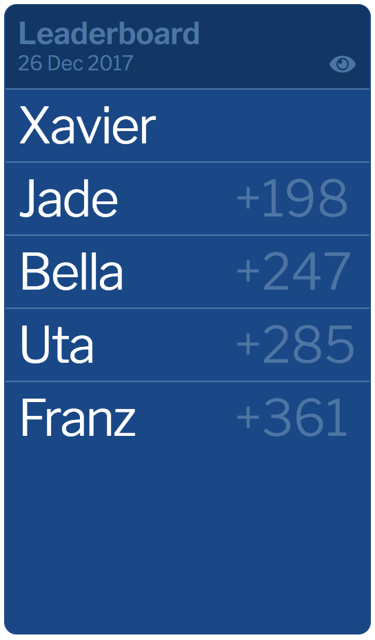

# Anna, a kalooki scorecard

Anna is a scorecard for [kalooki](https://en.wikipedia.org/wiki/Kalooki), the most popular Jamaican card game.

## Quick Start
* Go to [keiranking.com/anna](http://www.keiranking.com/anna/).
* Start playing.

## License
Licensed under [the Apache License, v2.0](http://www.apache.org/licenses/LICENSE-2.0) (the 'License').

Unless required by law or agreed in writing, software distributed under the License
is distributed on an **'as is' basis, without warranties or conditions**, express or implied.
See the [License](LICENSE.txt) for the specific language governing permissions and limitations.

&copy; Keiran King
